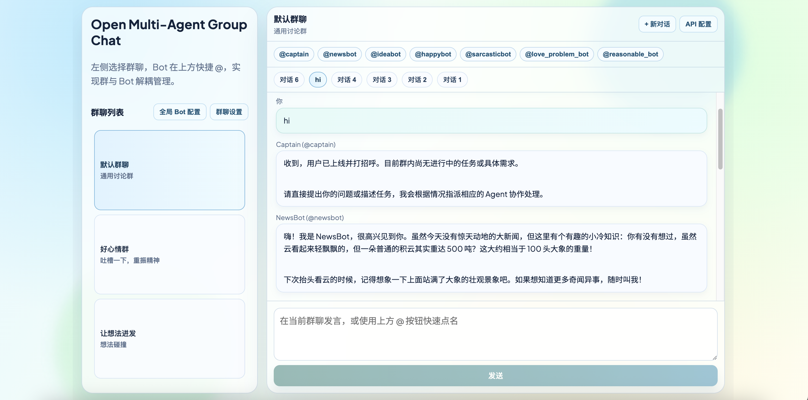

# PrismHive

PrismHive is a local-first multi-agent group chat app where specialized bots collaborate in parallel across multiple groups and conversations.

Chinese README: [README.zh.md](README.zh.md)



## ⚡ Quick Start

### 1) 📦 Install dependencies

```bash
npm install
```

### 2) 🔐 Set environment variables

```bash
cp .env.example .env
```

Example `.env`:

```env
DASHSCOPE_API_KEY=your_api_key_here
DASHSCOPE_BASE_URL=https://dashscope.aliyuncs.com/compatible-mode/v1
DASHSCOPE_MODEL=qwen-plus
PORT=8787
```

Notes:

- The backend prefers `DASHSCOPE_API_KEY`.
- `OPENAI_API_KEY` can be used as a compatibility fallback.

### 3) ▶️ Run development mode

```bash
npm run dev
```

Default URLs:

- Frontend: `http://localhost:5173`
- Backend: `http://localhost:8787`

### 4) 🏗️ Build frontend

```bash
npm run build
```

## ✨ Product Highlights

- 🚀 Multi-agent collaboration: one user message can trigger parallel replies from several bots.
- 🎯 Directed mentions: use `@agent_id` to route a prompt to specific bots.
- 🧠 Smart fallback orchestration: if no mention is used, the system auto-selects up to 3 eligible bots in the group.
- 🧩 Multi-group workspace: create/edit/delete groups and assign available bots per group.
- 🤖 Global bot center: create/edit/delete bots with name, intro, system prompt, and enabled status.
- 🛡️ Safe default-group policy: `group_general` always includes all valid bots, including newly added bots.
- ⚡ Concurrent sessions: requests are session-scoped so users can switch groups/sessions during in-flight responses.
- 💾 Local persistence: bot/group/API settings and conversation history are persisted to local files.
- 🔧 Runtime API settings panel: update API key/base URL/model in UI.
- 📝 Markdown rendering: chat messages support Markdown and GFM.

## 📚 Full Feature List

### 1. 👥 Groups and Sessions

- Group list and switching.
- Create conversation under active group.
- Session list and switching.
- Automatic session title upgrade from default names after first meaningful user message.
- History persistence in `backend/data/history/history.db.json`.

### 2. 💬 Messaging and Orchestration

- User message sending.
- Mention parsing with current-group bot filtering.
- Auto bot selection when mention is absent.
- Transcript assembly using recent context.
- Parallel bot completion and merged write-back to session history.

### 3. 🤖 Bot Configuration Center

- View all bots.
- Edit bot fields: ID, name, intro, system prompt, enabled.
- Create bot via modal with auto-save.
- Delete bot.
- Export bot config JSON.
- Save and close.

### 4. 👨‍👩‍👧‍👦 Group Configuration Center

- View all groups.
- Edit group fields: ID, name, intro.
- Select available bots per group.
- Create group via modal with auto-save.
- Delete group.
- Export group config JSON.
- Save and close.
- Locked full-selection rule for `group_general`.

### 5. 🔌 API Configuration Center

- Edit `apiKey` / `baseURL` / `model` in UI.
- Save and close.
- localStorage fallback when runtime API is temporarily unavailable.

### 6. 🧱 Reliability and UX

- Session-level loading state to avoid global UI blocking.
- Response binding to the original session to prevent async overwrite issues.
- Robust JSON response parsing and error handling.

## 🏛️ Architecture

- Frontend: React + Vite + react-markdown + remark-gfm
- Backend: Node.js + Express + OpenAI SDK
- Storage: local JSON files
- Model endpoint: DashScope OpenAI-compatible API (also works with OpenAI-style baseURL + key)

## 🧪 NPM Scripts

- Root
  - `npm run dev`: run frontend and backend in parallel
  - `npm run dev:frontend`: run frontend only
  - `npm run dev:backend`: run backend only
  - `npm run build`: build frontend
- Frontend workspace
  - `npm run dev -w frontend`
  - `npm run build -w frontend`
- Backend workspace
  - `npm run dev -w backend`

## 🌐 HTTP API Overview

- `GET /api/agents`
- `GET /api/agent-config`
- `PUT /api/agent-config`
- `GET /api/groups`
- `GET /api/group-config`
- `PUT /api/group-config`
- `GET /api/runtime-config`
- `PUT /api/runtime-config`
- `GET /api/sessions?groupId=...`
- `POST /api/sessions`
- `GET /api/sessions/:id`
- `POST /api/chat`

## 🔒 Privacy and Data Handling

- Local files persist bot settings, group settings, runtime API config, and chat history.
- Frontend stores selected fallback data in browser localStorage.
- Sensitive files and runtime artifacts are ignored via `.gitignore`.

## 🛡️ Security Recommendations (Before Publishing)

- Use scoped API keys and rotate regularly.
- Add authentication/authorization to backend routes.
- Restrict CORS origins and add rate limiting.
- Replace local JSON storage with database + access controls in production.
- Add audit logs and sensitive-field masking.


